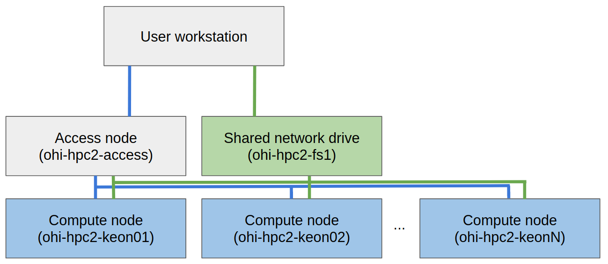

# UOHI-HPC
Documentation and demonstration script for use with University of Ottawa Heart Institute HPC Cluster


<!-- PROJECT LOGO -->
<br />
<p align="center">
  <a href="images/uohi-logo.png">
    
  </a>
</p>


<!-- TABLE OF CONTENTS -->
## Table of Contents

* [About the Project](#about-the-project)
* [Infrastructure](#intrastructure)
* [Access](#access)
* [Filesystem](#filesystem)
    * [Q-drive](#q-drive)
    * [Staging (scratch) space](#staging-(scratch)-space)
    * [Home directory](#home-directory)
* [Jobs](#jobs)
* [Container environment](#container-environment)
* [Contact](#contact)
* [Acknowledgements](#acknowledgements)


<!-- ABOUT THE PROJECT -->
## About The Project

This repository contains documentation and sample scripts to be used with the University of Ottawa Heart Institute High Performance Computing cluster. The goal of the project is to provide a shared compute environment for researchers at UOHI.


## Intrastructure
The cluster is build using the following frameworks:
* [Singularity](https://sylabs.io/singularity/): a secure container environment built for HPC applications.
* [CentOS](https://www.centos.org/): free, open-source linux distribution compatible with Red Hat Enterprise Linux.
* [Slurm](https://slurm.schedmd.com/overview.html): free, open-source job scheduler for Linux.

The cluster is composed of nodes, i.e. separate computers. Users interact with the cluster via the access-node `ohi-hpc2-access` using SSH and the linux shell.

<p>
    
</p>

The system currently has one compute node only, which is a Dell R7525. It is equipped as follows:
* Two AMD EPYC 7402 2.8GHz base (3.35GHz boost), 128M cache, 24 core/48 threads for a total of 48 cores/96 threads
* 256 GB of DDR4-3200 memory
* One 1.6TB NVMe U.2 drive
* Five 1.92TB SSD SATA drives
* Three passively cooled Nvidia Quadro RTX 6000 GPU each with 24GB of VRAM

## Access

Access to the cluster is managed by UOHI IT department using users `ottawaheart` credentials. Users must be added to the appropriate workgroup in order to gain access to the cluster. This can be requested from the administrator. 

The access node is open for SSH login from within the UOHI network or using VPN access.

From a Linux or MacOS workstation, the following command can be used to login:
```sh
ssh <username>@ohi-hpc2-access
```

From a Windows workstation, a third-party SSH client can be installed such as [PuTTY](https://www.putty.org/).

After authentication, users will be able to use issue commands to the Slurm scheduler to order to initiate jobs on the cluster. 

## Filesystem

### Q-drive
The cluster shares a common network filesystem, i.e. the `Q-drive` accessible at `/q/` from within the cluster and as drive `Q:\` from the Windows UOHI network. This drive is meant for long term storage, i.e. beyond the execution of a job. The `Q-drive` is an ideal location to store data and code that will be used across the HPC cluster.

The `Q-drive` is stored on a virtual machine backed up as per UOHI policy. It is connected via a 10Gb interface to the access and compute nodes. The protocol used is CIFS in order to provide access from both Linux and Windows systems. Directories within the `Q-drive` correspond to different approved projects and each have 2TB of allocated storage:

* /q/
    * projectA/
        * user1
        * user2
        * common
    * projectB/
        * user3
        * user4
        * common
    * ...

Each project leader is free to organize the storage space as they see fit. However, we suggest creating a subdirectory for each user as shown above as a workspace.


### Staging (scratch) space

The `Q-drive` being a network attached storage facility, the transfer speed and input/output operations per seconds is limited. In order to have rapid file access and avoid bottlenecks during a job execution, each compute node is equipped with SSD and NVMe disks that can be used for temporary storage but with fast access speed.

Each access node is configured with the following directories:
* /staging
    * fast/ : 1.5TB of NVMe PCIe 4.0 storage
    * large/ : 8TB of non-NVMe SSD storage

Data placed within the `/staging` directory is not shared between compute nodes. Users who require high-IOPS storage during a job would copy their data to the staging space, e.g. `/staging/fast/<username>/`, then execute their job and at termination, copy the results back to the `Q-drive` for long-term storage. We provide an example script that demonstrate this concept.

### Home directory

The `/home/<username>` directory on both the access and compute nodes is also shared across the cluster but data placed there is typically only accessible to individual users. We do not suggest using the home directory for long-term storage as there is limited storage space available.

## Jobs

The HPC cluster uses Slurm as a job scheduler. It allows users to request resources from the HPC cluster according to the needs of their specific job for a pre-specified amount of time.

Slurm provides several commands that can be issued to request, cancel and monitor jobs. Slurm manages the queue of jobs being requested by users. The user commands include: sacct, salloc, sattach, sbatch, sbcast, scancel, scontrol, sinfo, sprio, squeue, srun, sshare, sstat, strigger and sview. All of the commands can run anywhere in the cluster. An overview of command functionalities can be found at [Slurm Quickstart](https://slurm.schedmd.com/quickstart.html).

### Basic example job
The list of nodes can be obtained using:
```console
[ptheriault@ohi-hpc2-access ~]$ sinfo
PARTITION AVAIL  TIMELIMIT  NODES  STATE NODELIST 
batch*       up   infinite      1   idle ohi-hpc2-keon01 
```

Nodes are physical computers/servers with a certain number of sockets, CPU threads. The configuration of a node can be requested using the command:

```console
[ptheriault@ohi-hpc2-access ~]$ scontrol show node ohi-hpc2-keon01
NodeName=ohi-hpc2-keon01 Arch=x86_64 CoresPerSocket=24 
   CPUAlloc=0 CPUTot=96 CPULoad=0.16
   AvailableFeatures=(null)
   ActiveFeatures=(null)
   Gres=gpu:3(S:0-1)
   NodeAddr=ohi-hpc2-keon01 NodeHostName=ohi-hpc2-keon01 Version=20.02.4
   OS=Linux 3.10.0-1127.19.1.el7.x86_64 #1 SMP Tue Aug 25 17:23:54 UTC 2020 
   RealMemory=244565 AllocMem=0 FreeMem=230855 Sockets=2 Boards=1
   State=IDLE ThreadsPerCore=2 TmpDisk=0 Weight=1 Owner=N/A MCS_label=N/A
   Partitions=batch 
   BootTime=2020-09-24T14:48:56 SlurmdStartTime=2020-09-24T14:49:21
   CfgTRES=cpu=96,mem=244565M,billing=96,gres/gpu=3
   AllocTRES=
   CapWatts=n/a
   CurrentWatts=0 AveWatts=0
   ExtSensorsJoules=n/s ExtSensorsWatts=0 ExtSensorsTemp=n/s
```
We created a small demonstrated script `test.sh`:
```bash
#!/bin/bash

pwd; hostname; date

echo "Running program on $SLURM_CPUS_ON_NODE CPU cores"

sleep 60
```

And we execute the script on the compute node:
```console
[ptheriault@ohi-hpc2-access ~]$ srun -n1 test.sh
/home/ptheriault
ohi-hpc2-keon01
Wed Oct 21 09:36:56 UTC 2020
Running program on 2 CPU cores
```
During the execution of the above job, we can issue the `squeue` command from another terminal:
```console
[ptheriault@ohi-hpc2-access ~]$ squeue
             JOBID PARTITION     NAME     USER ST       TIME  NODES NODELIST(REASON) 
               155     batch  test.sh ptheriau  R       0:03      1 ohi-hpc2-keon01 
```

A job can be cancelled using the `scancel` command where 155 is the JOB ID listed in the output of `squeue` command:
```console
[ptheriault@ohi-hpc2-access ~]$ scancel 155
```

Once users have jobs running on a particular node, they are allowed to SSH directly into the node in order to monitor the progress of the job. This can also be helpful if a user needs to use SSH tunneling to run a development tool on the cluster such as [Jupyter Notebook](https://jupyter.org/). For example, if we try to SSH into `ohi-hpc2-keon01` without a job running, we get the message:
```console
[ptheriault@my-workstation:~]$ ssh ptheriault@ohi-hpc2-keon01
Access denied by pam_slurm_adopt: you have no active jobs on this node
Connection closed by xxx.xxx.xxx.xxx port 22
[ptheriault@my-workstation:~]$ 
```
Once a job is running, we can login:
```console
[ptheriault@my-workstation:~]$ ssh ptheriault@ohi-hpc2-keon01
Last login: Mon Oct 19 02:21:53 2020 from xxx.xxx.xxx.xxx
[ptheriault@ohi-hpc2-keon01 ~]$ 
```
Note that once the job terminates, the SSH connection to the compute node will also be terminated automatically.

### Ressource allocation
A user may want to execute an interactive session on a compute node, i.e. in order to issue commands rather than run a pre-specified script. This can be done with the following command:

```console
[ptheriault@ohi-hpc2-access ~]$ srun --nodes=1 --time=01:00:00 --mem=8GB --cpus-per-task=4 --gres=gpu:1 --pty bash
[ptheriault@ohi-hpc2-keon01 ~]$ squeue
             JOBID PARTITION     NAME     USER ST       TIME  NODES NODELIST(REASON) 
               157     batch     bash ptheriau  R       0:10      1 ohi-hpc2-keon01 
[ptheriault@ohi-hpc2-keon01 ~]$ exit
exit
[ptheriault@ohi-hpc2-access ~]$ 
```

In above console output, we notice that the first line is executed on the access node `ohi-hpc2-access` and the second line is a terminal session now running on the compute node `ohi-hpc2-keon01`. We executed the command `squeue` to show the job queue from the compute node. In many ways, requesting an interactive session is similar to connecting to a machine via SSH. 

We note that the previous commands had some supplemental options. 
* `--time=01:00:00`: set a time limit after which the task will automatically terminate. 
* `--mem=8GB`: requested 8 GB of RAM. 
* `--cpus-per-task=4`: requested 4 CPU threads
* `--gres=gpu:1`: requested 1 GPU accelerator
* `--pty`: specifies that the execution will be in pseudo terminal mode such that output is directed to the screen

The number of GPU requested can be selected from 1 to 3 given the resources available. For example, we can request a single GPU (`--gres=gpu:1`) and use the `nvidia-smi` system management interface command to list the available GPU:
```console
[ptheriault@ohi-hpc2-access ~]$ srun --nodes=1 --time=01:00:00 --mem=8GB --cpus-per-task=4 --gres=gpu:1 --pty bash
[ptheriault@ohi-hpc2-keon01 ~]$ nvidia-smi
Wed Oct 21 10:14:12 2020       
+-----------------------------------------------------------------------------+
| NVIDIA-SMI 450.51.06    Driver Version: 450.51.06    CUDA Version: 11.0     |
|-------------------------------+----------------------+----------------------+
| GPU  Name        Persistence-M| Bus-Id        Disp.A | Volatile Uncorr. ECC |
| Fan  Temp  Perf  Pwr:Usage/Cap|         Memory-Usage | GPU-Util  Compute M. |
|                               |                      |               MIG M. |
|===============================+======================+======================|
|   0  Quadro RTX 6000     On   | 00000000:25:00.0 Off |                    0 |
| N/A   22C    P8    14W / 250W |      0MiB / 22698MiB |      0%      Default |
|                               |                      |                  N/A |
+-------------------------------+----------------------+----------------------+
                                                                               
+-----------------------------------------------------------------------------+
| Processes:                                                                  |
|  GPU   GI   CI        PID   Type   Process name                  GPU Memory |
|        ID   ID                                                   Usage      |
|=============================================================================|
|  No running processes found                                                 |
+-----------------------------------------------------------------------------+
[ptheriault@ohi-hpc2-keon01 ~]$ 

```

We can also request three GPUs by modifying `--gres=gpu:3` as follows:
```console
[ptheriault@ohi-hpc2-access ~]$ srun --nodes=1 --time=01:00:00 --mem=8GB --cpus-per-task=4 --gres=gpu:3 --pty bash
[ptheriault@ohi-hpc2-keon01 ~]$ nvidia-smi
Wed Oct 21 10:16:11 2020       
+-----------------------------------------------------------------------------+
| NVIDIA-SMI 450.51.06    Driver Version: 450.51.06    CUDA Version: 11.0     |
|-------------------------------+----------------------+----------------------+
| GPU  Name        Persistence-M| Bus-Id        Disp.A | Volatile Uncorr. ECC |
| Fan  Temp  Perf  Pwr:Usage/Cap|         Memory-Usage | GPU-Util  Compute M. |
|                               |                      |               MIG M. |
|===============================+======================+======================|
|   0  Quadro RTX 6000     On   | 00000000:25:00.0 Off |                    0 |
| N/A   22C    P8    13W / 250W |      0MiB / 22698MiB |      0%      Default |
|                               |                      |                  N/A |
+-------------------------------+----------------------+----------------------+
|   1  Quadro RTX 6000     On   | 00000000:81:00.0 Off |                    0 |
| N/A   21C    P8    13W / 250W |      0MiB / 22698MiB |      0%      Default |
|                               |                      |                  N/A |
+-------------------------------+----------------------+----------------------+
|   2  Quadro RTX 6000     On   | 00000000:E2:00.0 Off |                    0 |
| N/A   21C    P8    12W / 250W |      0MiB / 22698MiB |      0%      Default |
|                               |                      |                  N/A |
+-------------------------------+----------------------+----------------------+
                                                                               
+-----------------------------------------------------------------------------+
| Processes:                                                                  |
|  GPU   GI   CI        PID   Type   Process name                  GPU Memory |
|        ID   ID                                                   Usage      |
|=============================================================================|
|  No running processes found                                                 |
+-----------------------------------------------------------------------------+
[ptheriault@ohi-hpc2-keon01 ~]$ 
```

## Container environment

*"A container is a standard unit of software that packages up code and all its dependencies so the application runs quickly and reliably from one computing environment to another. Containerized software will always run the same, regardless of the infrastructure."* (source: https://www.docker.com/resources/what-container)

In our case a container environment is particularly attractive because users may need certain libraries/software for their code to run. In such a case, they can create a container, which packages all those dependencies and can run on their own machine just as well as on the cluster.

[Singularity](https://sylabs.io/singularity/) is a secure container environment built for HPC applications. It is installed on the cluster. The main difference between Singularity and other container environment such as Docker is that users are limited to executing tasks without full root access to the system. Singularity is also useful because it stores the container environment as a single `.sif` file that can easily be transferred between computers. 


As a demonstration, we used a GPU-compatible container created from [Nvidia NGC](https://www.nvidia.com/en-us/gpu-cloud/) for the [TensorFlow](https://www.tensorflow.org/) machine learning library. Use used the container described at https://ngc.nvidia.com/catalog/containers/nvidia:tensorflow. We stored the `sif` file at `/q/CIED-AI/singularity_containers/nvcr_tf_20.06.sif`. 

We created a sample Slurm batch script that request specific resources and runs an instance of Jupyter Notebook on port 8888:

```bash
#!/usr/bin/env bash
#SBATCH --job-name=jupyter-gpu
#SBATCH --ntasks=1
#SBATCH --cpus-per-task=4
#SBATCH --ntasks-per-node=1
#SBATCH --time=24:00:00
#SBATCH --mem-per-cpu=2GB
#SBATCH --output=slurm-%A.out
#SBATCH --gres=gpu:1

pwd; hostname; date

export PROJECT_DIR=/q/CIED-AI
export SCRATCH=/staging/fast/ptheriault
export SINGULARITY_TMPDIR=$SCRATCH

srun /usr/local/bin/singularity exec --nv \
        --bind $PROJECT_DIR,$SCRATCH \
        $PROJECT_DIR/singularity_containers/tf_od_api_tf2_nv_custom.sif \
        jupyter lab --ip=0.0.0.0 --port=8888 --allow-root \
        --notebook-dir $PROJECT_DIR
```
We submit the task as a batch job:
```console
[ptheriault@ohi-hpc2-access ~]$ sbatch /q/CIED-AI/singularity_containers/start_tf_test_singularity.sh 
Submitted batch job 164
[ptheriault@ohi-hpc2-access ~]$ 
```
The output is saved as a text file `slurm-164.out`:
```console
/home/ptheriault
ohi-hpc2-keon01
Wed Oct 21 10:49:53 UTC 2020
Usage example: change_mofed_version.sh 4.5-1.0.1
2020-10-21 10:49:57.016725: I tensorflow/stream_executor/platform/default/dso_loader.cc:49] Successfully opened dynamic library$
[I 10:49:59.108 LabApp] jupyter_tensorboard extension loaded.
[I 10:49:59.306 LabApp] JupyterLab extension loaded from /usr/local/lib/python3.6/dist-packages/jupyterlab
[I 10:49:59.306 LabApp] JupyterLab application directory is /usr/local/share/jupyter/lab
[I 10:49:59.496 LabApp] [Jupytext Server Extension] NotebookApp.contents_manager_class is (a subclass of) jupytext.TextFileCont$
[I 10:49:59.601 LabApp] Serving notebooks from local directory: /q/CIED-AI
[I 10:49:59.601 LabApp] The Jupyter Notebook is running at:
[I 10:49:59.601 LabApp] http://hostname:8888/?token=aace208b5d3a6ca333765028f610115a5ea9b3804585b5ba
[I 10:49:59.601 LabApp]  or http://127.0.0.1:8888/?token=aace208b5d3a6ca333765028f610115a5ea9b3804585b5ba
[I 10:49:59.601 LabApp] Use Control-C to stop this server and shut down all kernels (twice to skip confirmation).
[C 10:49:59.608 LabApp]

    To access the notebook, open this file in a browser:
        file:///home/ptheriault/.local/share/jupyter/runtime/nbserver-54851-open.html
    Or copy and paste one of these URLs:
        http://hostname:8888/?token=aace208b5d3a6ca333765028f610115a5ea9b3804585b5ba
     or http://127.0.0.1:8888/?token=aace208b5d3a6ca333765028f610115a5ea9b3804585b5ba
```

In order to connect to the Jupyter Lab session, we must create an SSH tunnel from our workstation to the compute node:
```console
[ptheriault@my-workstation:~]$ ssh -CNL 8888:localhost:8888 ptheriault@ohi-hpc2-keon01

```
If this is correctly running, no output should be shown.

From our workstation, we can now open a browser session using the link we found on the last line of file `slurm-164.out`.


<!-- CONTACT -->
## Contact

ptheriault Theriault-Lauzier - ptheriault@ottawaheart.ca


<!-- ACKNOWLEDGEMENTS -->
## Acknowledgements
* Timothy Zakutney (UOHI)
* Andre Lecuyer (UOHI)
* Richard Clark (UOHI)
* Pierre Lefevre (UOHI)
* Christine Harvey (MITRE)


